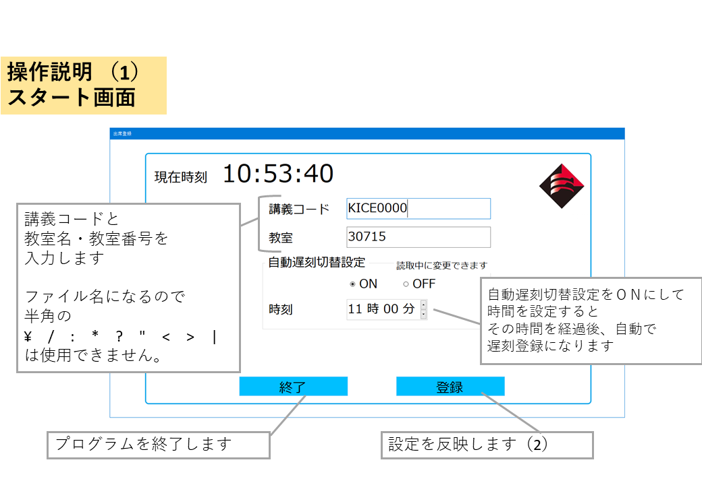
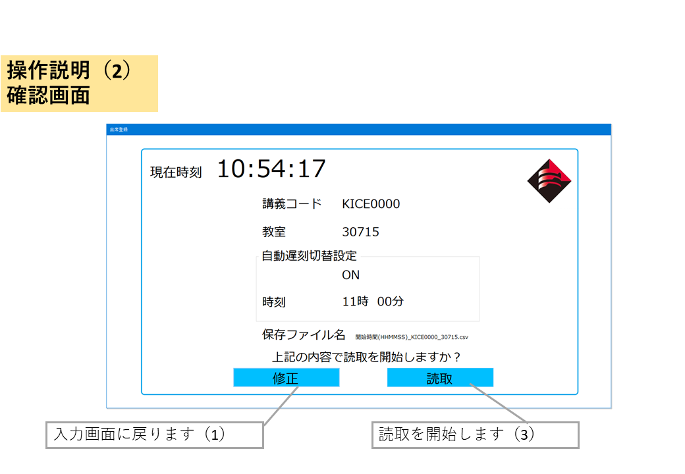
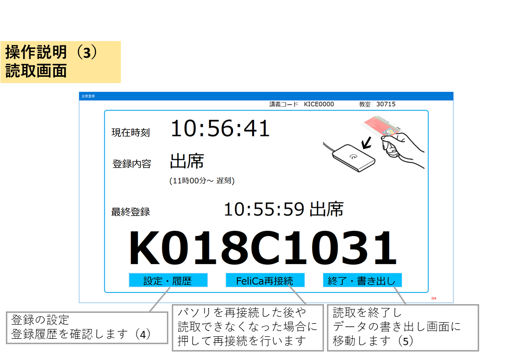
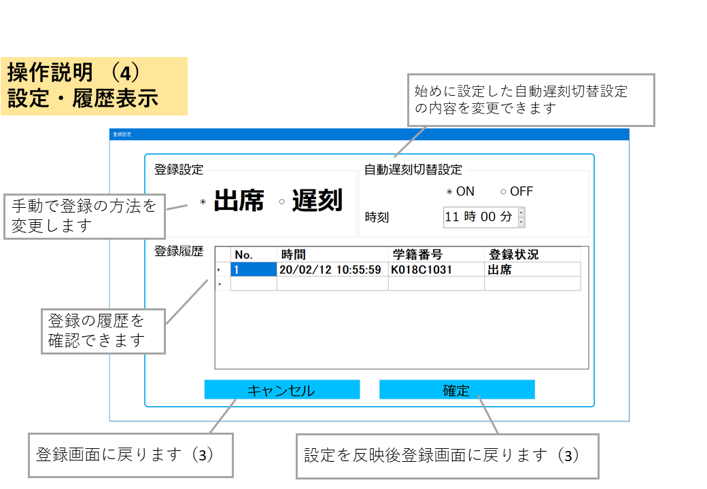
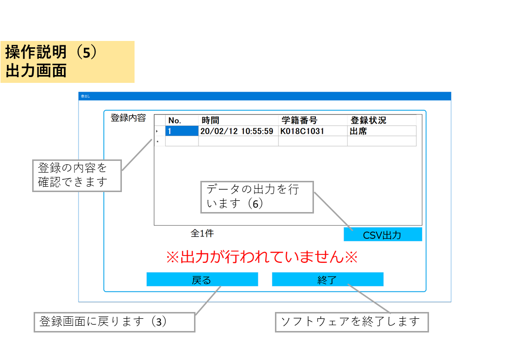
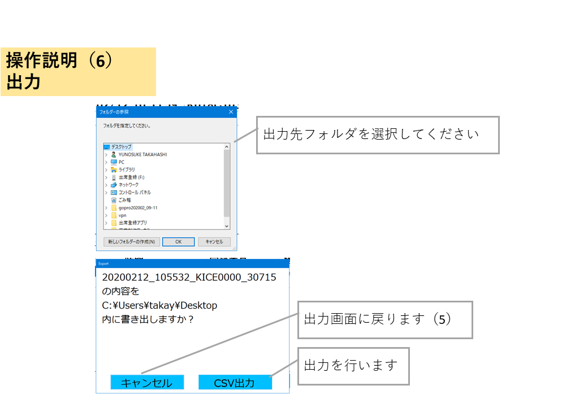

# Local-attendance-registration-system　について
Felicaリーダを使用した出席登録システムです。   
データベース構築不要で使用可能です。

# 使用ソフトウェア
[FeliCa Library](https://ja.osdn.net/projects/felicalib/)を使用します。 ダウンロード後、プロジェクト内に追加してください。   
パソリリーダのドライバは[こちら](https://www.sony.co.jp/Products/felica/consumer/support/download/nfcportsoftware.html)からインストールしてください。

# データ出力形式
出力ファイル名は以下の形式になります
```
日付_開始時間_講義コード_教室名.CSV
20200212_1053_KICE0000_30715.csvなど
```
出力CSVファイルは以下の形式で出力されます
```
日時,学籍番号,出席状況
20/02/12,10:55:59,K018C1031,1
20/02/12,10:56:60,K018C1335,1
```

# ソフトウェア使用方法
## スタート画面


## 確認画面


## 読取画面


## 設定・履歴表示


## 出力画面


## 出力
